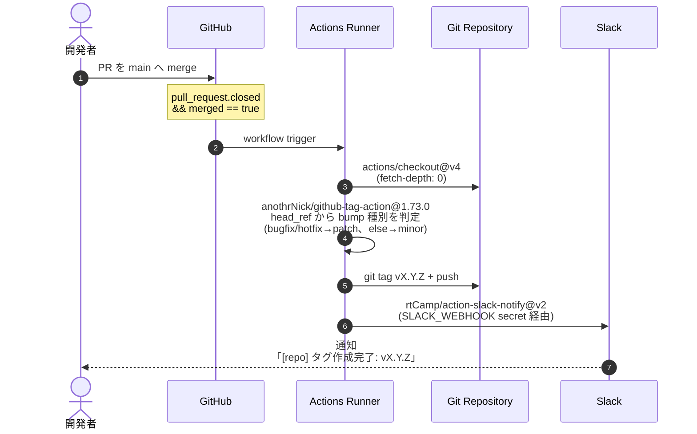

# GitHub Actions

このプロジェクトで動いている GitHub Actions ワークフロー一覧と、それぞれの動作・設定。

## ワークフロー一覧

| 名前 | ファイル | 発火条件 | 役割 |
|---|---|---|---|
| **`【_auto】Create git tag`** | [`.github/workflows/create_git_tag.yml`](../.github/workflows/create_git_tag.yml) | `main` への PR が **merge** されたとき | 自動 version bump + tag push + Slack 通知 |

---

## `【_auto】Create git tag`

### 概要

`main` ブランチに PR が merge されたら、以下を自動実行する:

1. 直近の git tag を取得 (なければ `INITIAL_VERSION: v0.1.0` から開始)
2. PR のブランチ名から bump 種別を判定
3. 新しい tag を push
4. Slack に結果を通知

GitHub の Releases ページから **手動でリリースを作る必要はない**。
初回 merge で `v0.1.0` が自動で打たれる。

### シーケンス



### bump ルール

| PR ブランチ名 (`head_ref`) | bump | 例 |
|---|---|---|
| `bugfix` を含む | patch | `v0.2.0` → `v0.2.1` |
| `hotfix` を含む | patch | `v0.2.0` → `v0.2.1` |
| それ以外 (`feature/*` など) | minor | `v0.2.0` → `v0.3.0` |

major bump (`v1.0.0` → `v2.0.0`) は現状自動化されていない。必要なら手動で tag を切る。

### 必要な GitHub Secrets

| Secret 名 | 用途 | 設定方法 |
|---|---|---|
| `GITHUB_TOKEN` | tag push 用 | 自動でセットされる (設定不要) |
| `SLACK_WEBHOOK` | Slack Incoming Webhook URL | `gh secret set SLACK_WEBHOOK` で登録 |

```bash
# Slack Webhook の登録
echo "https://hooks.slack.com/services/T.../B.../..." | gh secret set SLACK_WEBHOOK

# 登録確認
gh secret list
```

### 必要な permissions

```yaml
permissions:
  contents: write   # tag push に必要 (GitHub Actions のデフォルトは read)
```

### Slack 通知のフォーマット

| 結果 | 色 | メッセージ |
|---|---|---|
| 成功 | 紫 (`#4834d4`) | `タグ作成完了: vX.Y.Z` |
| 失敗 | 赤 (`#dc3545`) | `タグ作成に失敗しました` |

通知先チャンネルは Incoming Webhook 側の設定に従う (`SLACK_CHANNEL` 未指定)。

### トラブルシューティング

| 症状 | 原因 | 対処 |
|---|---|---|
| tag が push されない | `permissions.contents: write` が無い | workflow に追記 |
| Slack 通知が来ない | `SLACK_WEBHOOK` 未登録 / URL 失効 | `gh secret set SLACK_WEBHOOK` で再登録 |
| 既存 tag と同じ番号で止まる | bump 計算が `none` になっている | `DEFAULT_BUMP` の判定式を見直す |
| 同じ merge で workflow が再発火 | merge 後にリトライした | actions の history を確認、通常は問題なし |

### Webhook URL を再生成したいとき

何らかの理由で Webhook URL を漏洩させた場合:

```
1. Slack の App 設定 (https://api.slack.com/apps) で対象 App を開く
2. Incoming Webhooks から 該当 URL を Remove → Add New Webhook で再発行
3. gh secret set SLACK_WEBHOOK で新 URL を登録
```

---

## 今後追加候補

| ワークフロー案 | 用途 |
|---|---|
| `test.yml` | push / PR ごとに `php artisan test` を走らせる |
| `lint.yml` | Pint (Laravel 標準 PHP-CS-Fixer) + Larastan で静的解析 |
| `deploy.yml` | tag を切ったら本番にデプロイ |
| `create_github_release.yml` | tag に紐づく GitHub Release を自動生成 (リリースノート付き) |

必要になったタイミングで追加する。
